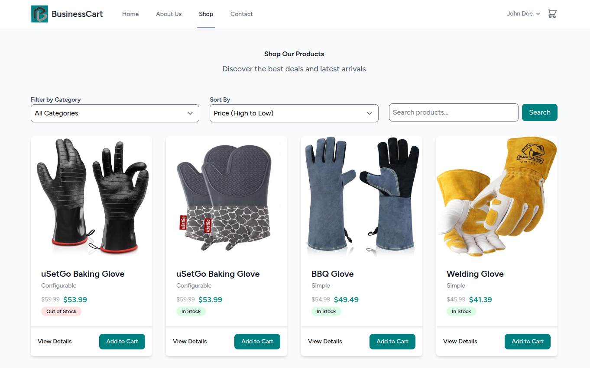
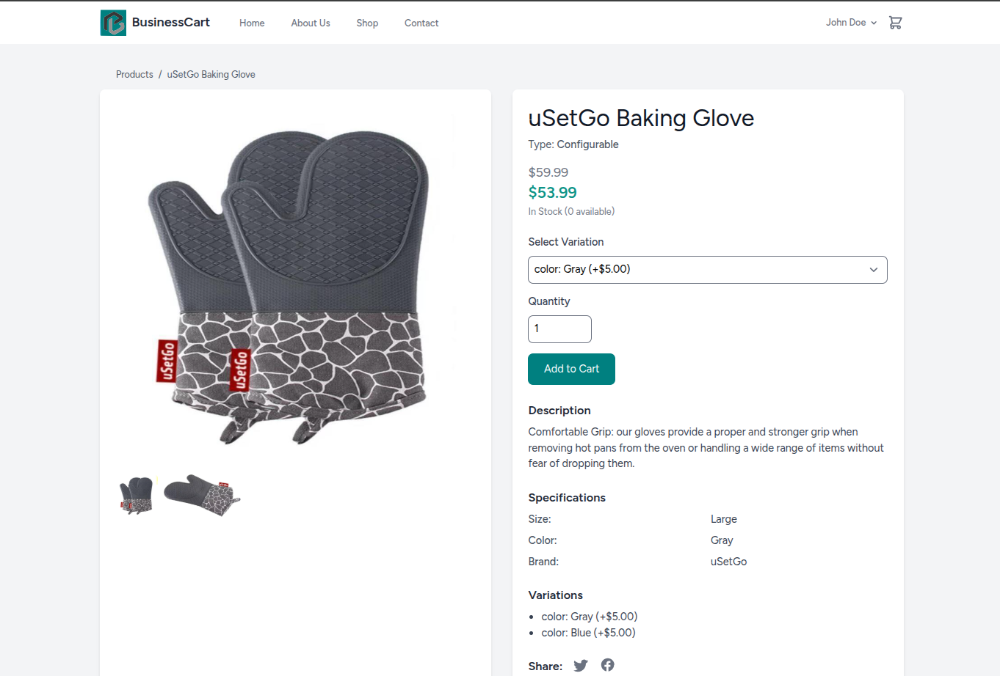
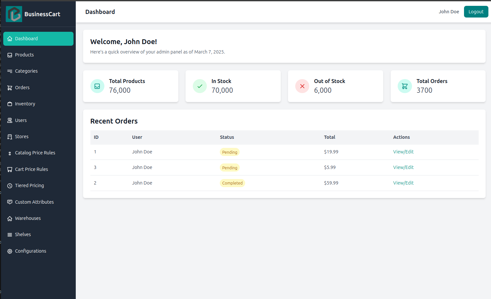

<div align="center">

<a href="http://localhost:8000" style="display: inline-flex; align-items: center; gap: 8px; text-decoration: none;">

</a>

---


</div>

# BusinessCart D2C
A PHP-based D2C e-commerce platform designed for flexibility and customization. This project is under active development, aiming to incorporate advanced e-commerce functionalities inspired by platforms like Magento.

## Table of Contents
- [Features](#features)
- [Missing Features](#missing-features)
- [Installation](#installation)
- [Getting Started](#getting-started)
- [Screenshots](#screenshots)
- [Roadmap](#roadmap)
- [Contributing](#contributing)
- [License](#license)

## Features
- **User Authentication & Management**:
  - User registration, login, and logout.
  - Role-based access (`admin`, `customer`).
  - User address management (`shipping`, `billing`).
- **Product Management**:
  - Full CRUD for products.
  - Multiple product types (`simple`, `configurable`).
  - Product image uploads.
  - Custom attributes.
- **Cart Functionality**:
  - Add/remove products.
  - Basic persistence for logged-in users.
- **Order Management**:
  - Orders tied to `user_id`.
- **Admin Dashboard**:
  - Product CRUD with images.
  - User address management.

## Missing Features
The following features are planned for future development:
- **User Management**:
  - Customer groups and segmentation.
  - Wishlists.
  - Newsletter subscriptions.
- **Product/Catalog**:
  - Virtual and downloadable products.
  - Attribute sets.
  - Tier pricing.
- **Cart & Checkout**:
  - Guest checkout.
  - Cart rules (promotions).
  - Multi-step checkout.
- **Orders & Payments**:
  - Payment gateway integrations (e.g., Stripe).
  - Multi-currency support.
- **Shipping**:
  - Configurable shipping methods.

## Installation
To set up **BusinessCart-B2C** locally, follow these steps:

### Prerequisites
- **PHP**: Version 8.1 or higher.
- **Composer**: For PHP dependency management.
- **Node.js & NPM**: For front-end assets.
- **SQLite**: Default database (or configure MySQL/PostgreSQL).

### Steps
1. **Clone the Repository**:
   ```bash
   git clone https://github.com/syedzaidi-magento/BusinessCart-B2C.git
   cd BusinessCart-B2C
   ```

2. **Install PHP Dependencies**:
   ```bash
   composer install
   ```

3. **Install JavaScript/CSS Dependencies**:
   ```bash
   npm install
   ```

4. **Configure Environment**:
   Copy the example environment file:
   ```bash
   cp .env.example .env
   ```
   Generate an application key:
   ```bash
   php artisan key:generate
   ```

5. **Set Up Database**:
   Edit `.env` to configure your database (example uses SQLite):
   ```env
   DB_CONNECTION=sqlite
   DB_DATABASE=/absolute/path/to/database.sqlite
   ```
   Run migrations:
   ```bash
   php artisan migrate
   ```

6. **Compile Front-End Assets**:
   ```bash
   npm run dev
   ```

7. **Run the Application**:
   ```bash
   php artisan serve
   ```
   Visit [http://localhost:8000](http://localhost:8000) in your browser.

## Getting Started
- **Register a User**: Navigate to `/register` to create an account.
- **Add Products (Admin)**: Log in as an admin (role = 'admin') and go to `/admin/products`.
- **Manage Addresses**: Visit `/user/addresses` to add shipping and billing addresses.

## Screenshots
- **Product Listing**:
  

- **Product Detail**:
  


- **Admin Dashboard**:
  

*Note: The screenshots actual images may not updated in this repository.*

## Roadmap
- **Short-term**:
  - Implement guest checkout.
  - Add Stripe payment integration.
- **Mid-term**:
  - Introduce product attribute sets.
  - Enable layered navigation.
- **Long-term**:
  - Integrate Elasticsearch for advanced search.
  - Add multi-currency and multi-language support.

## Contributing
We welcome contributions! To get started:

1. **Fork the repository**.
2. **Create a feature branch**:
   ```bash
   git checkout -b feature/YourFeature
   ```
3. **Commit your changes**:
   ```bash
   git commit -am 'Add YourFeature'
   ```
4. **Push to your branch**:
   ```bash
   git push origin feature/YourFeature
   ```
5. **Open a Pull Request**.

Please follow our code of conduct and ensure your code passes all tests.

## License
This project is licensed under the MIT License:
